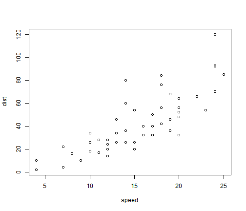

Title
========================================================

<pre class="knitr r">options(markdown.HTML.header = unlist(
  sapply(system.file('misc', c('vignette.css', 'datatables.txt'), package = 'knitr'), readLines)
  )
)
</pre>

##  oo
This is an R Markdown document. Markdown is a simple formatting syntax for authoring web pages (click the **Help** toolbar button for more details on using R Markdown).

### 11
When you click the **Knit HTML** button a web page will be generated that includes both content as well as the output of any embedded R code chunks within the document. You can embed an R code chunk like this:

### 22

<pre class="knitr r">summary(cars)
</pre>

<pre class="knitr r">##      speed           dist    
##  Min.   : 4.0   Min.   :  2  
##  1st Qu.:12.0   1st Qu.: 26  
##  Median :15.0   Median : 36  
##  Mean   :15.4   Mean   : 43  
##  3rd Qu.:19.0   3rd Qu.: 56  
##  Max.   :25.0   Max.   :120
</pre>

## gg
You can also embed plots, for example:

<pre class="knitr r">plot(cars)
</pre>

# oo

<pre class="knitr r">library(knitr)
kable(mtcars, 'html', table.attr='id="mtcars_table"')
</pre>

<table id="mtcars_table">
 <thead>
  <tr>
   <th>   </th>
   <th> mpg </th>
   <th> cyl </th>
   <th> disp </th>
   <th> hp </th>
   <th> drat </th>
   <th> wt </th>
   <th> qsec </th>
   <th> vs </th>
   <th> am </th>
   <th> gear </th>
   <th> carb </th>
  </tr>
 </thead>
<tbody>
  <tr>
   <td> Mazda RX4 </td>
   <td> 21.0 </td>
   <td> 6 </td>
   <td> 160.0 </td>
   <td> 110 </td>
   <td> 3.90 </td>
   <td> 2.620 </td>
   <td> 16.46 </td>
   <td> 0 </td>
   <td> 1 </td>
   <td> 4 </td>
   <td> 4 </td>
  </tr>
  <tr>
   <td> Mazda RX4 Wag </td>
   <td> 21.0 </td>
   <td> 6 </td>
   <td> 160.0 </td>
   <td> 110 </td>
   <td> 3.90 </td>
   <td> 2.875 </td>
   <td> 17.02 </td>
   <td> 0 </td>
   <td> 1 </td>
   <td> 4 </td>
   <td> 4 </td>
  </tr>
  <tr>
   <td> Datsun 710 </td>
   <td> 22.8 </td>
   <td> 4 </td>
   <td> 108.0 </td>
   <td>  93 </td>
   <td> 3.85 </td>
   <td> 2.320 </td>
   <td> 18.61 </td>
   <td> 1 </td>
   <td> 1 </td>
   <td> 4 </td>
   <td> 1 </td>
  </tr>
  <tr>
   <td> Hornet 4 Drive </td>
   <td> 21.4 </td>
   <td> 6 </td>
   <td> 258.0 </td>
   <td> 110 </td>
   <td> 3.08 </td>
   <td> 3.215 </td>
   <td> 19.44 </td>
   <td> 1 </td>
   <td> 0 </td>
   <td> 3 </td>
   <td> 1 </td>
  </tr>
  <tr>
   <td> Hornet Sportabout </td>
   <td> 18.7 </td>
   <td> 8 </td>
   <td> 360.0 </td>
   <td> 175 </td>
   <td> 3.15 </td>
   <td> 3.440 </td>
   <td> 17.02 </td>
   <td> 0 </td>
   <td> 0 </td>
   <td> 3 </td>
   <td> 2 </td>
  </tr>
  <tr>
   <td> Valiant </td>
   <td> 18.1 </td>
   <td> 6 </td>
   <td> 225.0 </td>
   <td> 105 </td>
   <td> 2.76 </td>
   <td> 3.460 </td>
   <td> 20.22 </td>
   <td> 1 </td>
   <td> 0 </td>
   <td> 3 </td>
   <td> 1 </td>
  </tr>
  <tr>
   <td> Duster 360 </td>
   <td> 14.3 </td>
   <td> 8 </td>
   <td> 360.0 </td>
   <td> 245 </td>
   <td> 3.21 </td>
   <td> 3.570 </td>
   <td> 15.84 </td>
   <td> 0 </td>
   <td> 0 </td>
   <td> 3 </td>
   <td> 4 </td>
  </tr>
  <tr>
   <td> Merc 240D </td>
   <td> 24.4 </td>
   <td> 4 </td>
   <td> 146.7 </td>
   <td>  62 </td>
   <td> 3.69 </td>
   <td> 3.190 </td>
   <td> 20.00 </td>
   <td> 1 </td>
   <td> 0 </td>
   <td> 4 </td>
   <td> 2 </td>
  </tr>
  <tr>
   <td> Merc 230 </td>
   <td> 22.8 </td>
   <td> 4 </td>
   <td> 140.8 </td>
   <td>  95 </td>
   <td> 3.92 </td>
   <td> 3.150 </td>
   <td> 22.90 </td>
   <td> 1 </td>
   <td> 0 </td>
   <td> 4 </td>
   <td> 2 </td>
  </tr>
  <tr>
   <td> Merc 280 </td>
   <td> 19.2 </td>
   <td> 6 </td>
   <td> 167.6 </td>
   <td> 123 </td>
   <td> 3.92 </td>
   <td> 3.440 </td>
   <td> 18.30 </td>
   <td> 1 </td>
   <td> 0 </td>
   <td> 4 </td>
   <td> 4 </td>
  </tr>
  <tr>
   <td> Merc 280C </td>
   <td> 17.8 </td>
   <td> 6 </td>
   <td> 167.6 </td>
   <td> 123 </td>
   <td> 3.92 </td>
   <td> 3.440 </td>
   <td> 18.90 </td>
   <td> 1 </td>
   <td> 0 </td>
   <td> 4 </td>
   <td> 4 </td>
  </tr>
  <tr>
   <td> Merc 450SE </td>
   <td> 16.4 </td>
   <td> 8 </td>
   <td> 275.8 </td>
   <td> 180 </td>
   <td> 3.07 </td>
   <td> 4.070 </td>
   <td> 17.40 </td>
   <td> 0 </td>
   <td> 0 </td>
   <td> 3 </td>
   <td> 3 </td>
  </tr>
  <tr>
   <td> Merc 450SL </td>
   <td> 17.3 </td>
   <td> 8 </td>
   <td> 275.8 </td>
   <td> 180 </td>
   <td> 3.07 </td>
   <td> 3.730 </td>
   <td> 17.60 </td>
   <td> 0 </td>
   <td> 0 </td>
   <td> 3 </td>
   <td> 3 </td>
  </tr>
  <tr>
   <td> Merc 450SLC </td>
   <td> 15.2 </td>
   <td> 8 </td>
   <td> 275.8 </td>
   <td> 180 </td>
   <td> 3.07 </td>
   <td> 3.780 </td>
   <td> 18.00 </td>
   <td> 0 </td>
   <td> 0 </td>
   <td> 3 </td>
   <td> 3 </td>
  </tr>
  <tr>
   <td> Cadillac Fleetwood </td>
   <td> 10.4 </td>
   <td> 8 </td>
   <td> 472.0 </td>
   <td> 205 </td>
   <td> 2.93 </td>
   <td> 5.250 </td>
   <td> 17.98 </td>
   <td> 0 </td>
   <td> 0 </td>
   <td> 3 </td>
   <td> 4 </td>
  </tr>
  <tr>
   <td> Lincoln Continental </td>
   <td> 10.4 </td>
   <td> 8 </td>
   <td> 460.0 </td>
   <td> 215 </td>
   <td> 3.00 </td>
   <td> 5.424 </td>
   <td> 17.82 </td>
   <td> 0 </td>
   <td> 0 </td>
   <td> 3 </td>
   <td> 4 </td>
  </tr>
  <tr>
   <td> Chrysler Imperial </td>
   <td> 14.7 </td>
   <td> 8 </td>
   <td> 440.0 </td>
   <td> 230 </td>
   <td> 3.23 </td>
   <td> 5.345 </td>
   <td> 17.42 </td>
   <td> 0 </td>
   <td> 0 </td>
   <td> 3 </td>
   <td> 4 </td>
  </tr>
  <tr>
   <td> Fiat 128 </td>
   <td> 32.4 </td>
   <td> 4 </td>
   <td>  78.7 </td>
   <td>  66 </td>
   <td> 4.08 </td>
   <td> 2.200 </td>
   <td> 19.47 </td>
   <td> 1 </td>
   <td> 1 </td>
   <td> 4 </td>
   <td> 1 </td>
  </tr>
  <tr>
   <td> Honda Civic </td>
   <td> 30.4 </td>
   <td> 4 </td>
   <td>  75.7 </td>
   <td>  52 </td>
   <td> 4.93 </td>
   <td> 1.615 </td>
   <td> 18.52 </td>
   <td> 1 </td>
   <td> 1 </td>
   <td> 4 </td>
   <td> 2 </td>
  </tr>
  <tr>
   <td> Toyota Corolla </td>
   <td> 33.9 </td>
   <td> 4 </td>
   <td>  71.1 </td>
   <td>  65 </td>
   <td> 4.22 </td>
   <td> 1.835 </td>
   <td> 19.90 </td>
   <td> 1 </td>
   <td> 1 </td>
   <td> 4 </td>
   <td> 1 </td>
  </tr>
  <tr>
   <td> Toyota Corona </td>
   <td> 21.5 </td>
   <td> 4 </td>
   <td> 120.1 </td>
   <td>  97 </td>
   <td> 3.70 </td>
   <td> 2.465 </td>
   <td> 20.01 </td>
   <td> 1 </td>
   <td> 0 </td>
   <td> 3 </td>
   <td> 1 </td>
  </tr>
  <tr>
   <td> Dodge Challenger </td>
   <td> 15.5 </td>
   <td> 8 </td>
   <td> 318.0 </td>
   <td> 150 </td>
   <td> 2.76 </td>
   <td> 3.520 </td>
   <td> 16.87 </td>
   <td> 0 </td>
   <td> 0 </td>
   <td> 3 </td>
   <td> 2 </td>
  </tr>
  <tr>
   <td> AMC Javelin </td>
   <td> 15.2 </td>
   <td> 8 </td>
   <td> 304.0 </td>
   <td> 150 </td>
   <td> 3.15 </td>
   <td> 3.435 </td>
   <td> 17.30 </td>
   <td> 0 </td>
   <td> 0 </td>
   <td> 3 </td>
   <td> 2 </td>
  </tr>
  <tr>
   <td> Camaro Z28 </td>
   <td> 13.3 </td>
   <td> 8 </td>
   <td> 350.0 </td>
   <td> 245 </td>
   <td> 3.73 </td>
   <td> 3.840 </td>
   <td> 15.41 </td>
   <td> 0 </td>
   <td> 0 </td>
   <td> 3 </td>
   <td> 4 </td>
  </tr>
  <tr>
   <td> Pontiac Firebird </td>
   <td> 19.2 </td>
   <td> 8 </td>
   <td> 400.0 </td>
   <td> 175 </td>
   <td> 3.08 </td>
   <td> 3.845 </td>
   <td> 17.05 </td>
   <td> 0 </td>
   <td> 0 </td>
   <td> 3 </td>
   <td> 2 </td>
  </tr>
  <tr>
   <td> Fiat X1-9 </td>
   <td> 27.3 </td>
   <td> 4 </td>
   <td>  79.0 </td>
   <td>  66 </td>
   <td> 4.08 </td>
   <td> 1.935 </td>
   <td> 18.90 </td>
   <td> 1 </td>
   <td> 1 </td>
   <td> 4 </td>
   <td> 1 </td>
  </tr>
  <tr>
   <td> Porsche 914-2 </td>
   <td> 26.0 </td>
   <td> 4 </td>
   <td> 120.3 </td>
   <td>  91 </td>
   <td> 4.43 </td>
   <td> 2.140 </td>
   <td> 16.70 </td>
   <td> 0 </td>
   <td> 1 </td>
   <td> 5 </td>
   <td> 2 </td>
  </tr>
  <tr>
   <td> Lotus Europa </td>
   <td> 30.4 </td>
   <td> 4 </td>
   <td>  95.1 </td>
   <td> 113 </td>
   <td> 3.77 </td>
   <td> 1.513 </td>
   <td> 16.90 </td>
   <td> 1 </td>
   <td> 1 </td>
   <td> 5 </td>
   <td> 2 </td>
  </tr>
  <tr>
   <td> Ford Pantera L </td>
   <td> 15.8 </td>
   <td> 8 </td>
   <td> 351.0 </td>
   <td> 264 </td>
   <td> 4.22 </td>
   <td> 3.170 </td>
   <td> 14.50 </td>
   <td> 0 </td>
   <td> 1 </td>
   <td> 5 </td>
   <td> 4 </td>
  </tr>
  <tr>
   <td> Ferrari Dino </td>
   <td> 19.7 </td>
   <td> 6 </td>
   <td> 145.0 </td>
   <td> 175 </td>
   <td> 3.62 </td>
   <td> 2.770 </td>
   <td> 15.50 </td>
   <td> 0 </td>
   <td> 1 </td>
   <td> 5 </td>
   <td> 6 </td>
  </tr>
  <tr>
   <td> Maserati Bora </td>
   <td> 15.0 </td>
   <td> 8 </td>
   <td> 301.0 </td>
   <td> 335 </td>
   <td> 3.54 </td>
   <td> 3.570 </td>
   <td> 14.60 </td>
   <td> 0 </td>
   <td> 1 </td>
   <td> 5 </td>
   <td> 8 </td>
  </tr>
  <tr>
   <td> Volvo 142E </td>
   <td> 21.4 </td>
   <td> 4 </td>
   <td> 121.0 </td>
   <td> 109 </td>
   <td> 4.11 </td>
   <td> 2.780 </td>
   <td> 18.60 </td>
   <td> 1 </td>
   <td> 1 </td>
   <td> 4 </td>
   <td> 2 </td>
  </tr>
</tbody>
</table>

Note we assigned an `id` to the table, and next we use the `DataTables` library to tweak the table.

    

